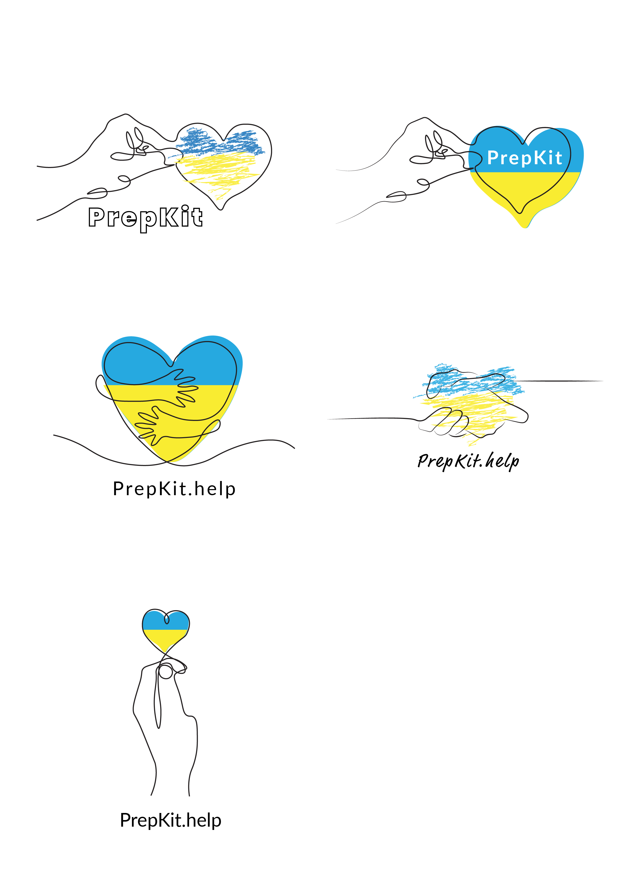

This repo was created during the [Hackathon4Ukraine](https://www.eventbrite.co.uk/e/hackathon4ukraine-tickets-293387910137?keep_tld=1). 

## [Frontend on Netlify](https://determined-booth-c58f9d.netlify.app/)
## [Figma UX draft](https://www.figma.com/file/xdWMsBGT1GOHQVgLNdTmnp/prepkit.help?node-id=0%3A1)
## [Presentation PDF](https://unifiedapi.io/prepkit/)
## Goal

The goal is to create a public website aggregating information for Ukrainian refugees:

> There is a large number of businesses and government organizations currently
offering free or discounted services for Ukrainians. Provide a way to dynamically
gather information about these services and what they have to offer, as well as
present them in a way that would be easy to read and access.




# Code

start:

```sh
./startup.sh
```

## Frontend

We use react.

install:

```sh
npm i
```

start:

```sh
npm start
```

### Mockups


## Backend

We use python with flask and mongoDB.

install:

```sh
pip install -r requirements.txt
```

start REST API server in folder `backend` with:

```sh
# development
export FLASK_APP=main.py; flask run

# production
waitress-serve --port=80 "main:app"
```
